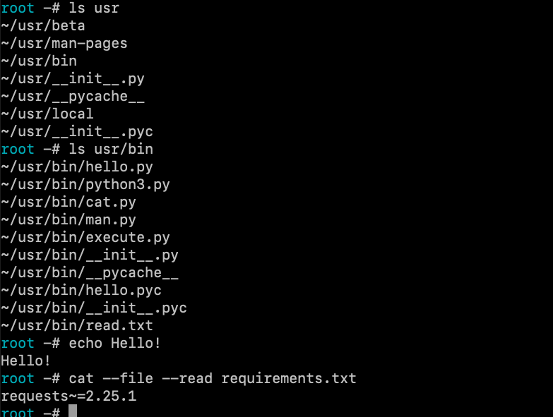

# KTerminal
KTerminal is a light, easy to use Python 3.9 Terminal that 
was perfected and published on May 15th. With over 10 commands (Builtin, and external),
the console has been built to support over 50 different compilers.

KTerminal contains a bunch of symbols and it's skeleton was built
upon inspiration from the original BASH terminal, in 
combination with the Arch Linux pre-setup terminal.

The KTerminal features a Unix-Like file structure containing a ./usr directory,
which stores python caches and essential files.

Please enjoy this bash. Star it if you do.