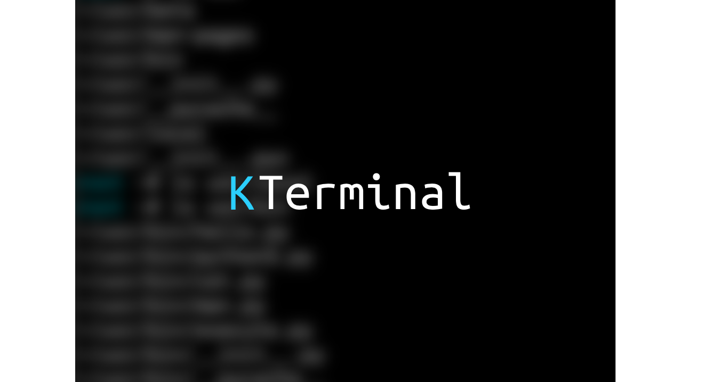
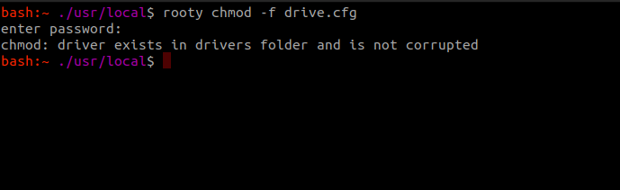
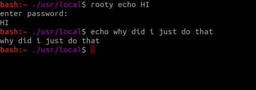

# KTerminal

KTerminal is a light, easy to use Python 3.9 Terminal that 
was perfected and published on May 15th. With over 10 commands (Builtin, and external),
the console has been built to support over 50 different compilers.

KTerminal contains a bunch of symbols, and it's skeleton was built
upon inspiration from the original BASH terminal.

Inspiration from Bash and it's utilities

Running commands from the ROOT user

The KTerminal features a Unix-Like file structure containing a ./usr directory,
which stores python caches and essential files.

Please enjoy this bash. Star it if you do.

# A Tour Inside KTerminal
## Directories
The directories in KTerminal are based off of the linux
source tree. featuring usr, drivers, and fs. As
well as a system.home directory where apps are stored.
## Apps & Games
The games that come packaged in feature
- vim

It isn't really vim, it's just a console-based text editor.
vim for KTerminal is in early access and is currently just a
writing program with a basic text box.

there's also a application handler built in.

## PKG
Package manager. Uses Https to gather information and
install features.

the package manager searches links (usually github), 
for a repository corresponding with the arguments.
it then checks for the main file and downloads it to your scripts directory.
# KTerminal Internals
## usr
The usr directory contains the bin, man-pages, and local subdirectories.

this contains user caches and files.

## system
system is the opposer to usr, containing home/apps
and home/appscripts (where app scripts are usually stored),
system is a very safer and much cleaner area.

## usr/sbin
C Binaries are run in this location.
C Scripts & Binaries are run from here.